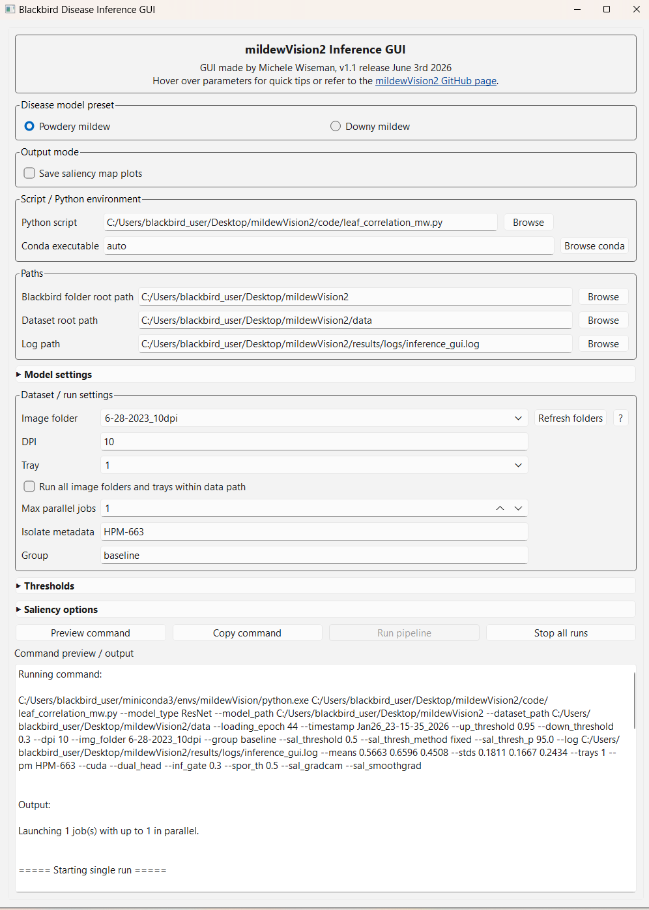

# mildewVision2 Inference GUI

A desktop graphical user interface for running the `mildewVision2` Blackbird disease inference pipeline. The GUI provides dropdowns, file browsers, preset model options, batch execution, and command previews for powdery mildew and downy mildew image analysis.



---

## Overview

The `mildewVision2` GUI is designed to make the Blackbird image inference workflow easier to run without manually editing long shell commands. It wraps the existing command-line inference scripts and generates the appropriate `argparse` command based on user-selected options.

The GUI can be used to:

* Select powdery mildew or downy mildew model presets
* Browse for model, script, dataset, and log paths
* Automatically populate image folders and tray folders from a selected dataset directory
* Automatically infer DPI from image folder names such as `5-18-2026_10dpi`
* Preview the exact command before running
* Copy the command to the clipboard
* Run a single image folder / tray combination
* Run all image folder / tray combinations in a dataset folder
* Run up to 4 jobs in parallel
* Stop active runs
* Optionally save saliency map plots
* Hide or reveal advanced model, threshold, and saliency settings

The GUI does **not** replace the underlying inference scripts. It is a launcher for the existing `mildewVision2` pipeline.

---

## Expected Dataset Structure

The GUI expects image data to be organized as:

```text
dataset_root/
├── image_folder_1/
│   ├── tray_1/
│   │   ├── image_001.png
│   │   ├── image_002.png
│   │   └── ...
│   ├── tray_2/
│   └── ...
├── image_folder_2/
│   ├── tray_1/
│   └── ...
```

Example:

```text
D:/Stacked/ncgr_inoculation/
├── 5-13-2026_5dpi/
│   ├── HPM-663_T1/
│   ├── HPM-663_T2/
│   └── HPM-1269_T1/
├── 5-18-2026_10dpi/
│   ├── HPM-663_T1/
│   └── HPM-1269_T1/
```

If the image folder name ends in `_Xdpi`, the GUI will automatically set the DPI value.

Examples:

```text
5-13-2026_5dpi    -> DPI = 5
5-18-2026_10dpi   -> DPI = 10
11-10-2025_11dpi  -> DPI = 11
```

---

## Disease Model Presets

The GUI currently includes presets for powdery mildew and downy mildew.

### Powdery mildew preset

The powdery mildew preset uses:

```bash
--model_type ResNet
--loading_epoch 44
--up_threshold 0.95
--down_threshold 0.3
--outdim 2
--means 0.5663 0.6596 0.4508
--stds 0.1811 0.1667 0.2434
--timestamp Jan26_23-15-35_2026
--pretrained
--sal_thresh_method fixed
--dual_head
--inf_gate 0.3
--spor_th 0.5
```

The powdery mildew model is treated as a dual-head model:

* Head 0: infected / hyphal signal
* Head 1: sporulation signal

### Downy mildew preset

The downy mildew preset uses:

```bash
--model_type VGG
--loading_epoch 66
--outdim 2
--means 0.5765 0.6403 0.4478
--stds 0.1584 0.1574 0.1902
--timestamp Nov26_02-59-03_2024
--pretrained
--up_threshold 0.8
--down_threshold 0.2
```

The downy mildew preset disables dual-head options because the current downy model is not treated as a powdery mildew-style infected/sporulation dual-head model.

---

## Main GUI Sections

### Disease model preset

Select either:

* Powdery mildew
* Downy mildew

Changing the disease model updates the default model architecture, checkpoint epoch, normalization values, thresholds, timestamp, and dual-head settings.

### Output mode

The **Save saliency map plots** checkbox switches the default script from:

```text
../leaf_correlation_mw.py
```

to:

```text
../plot_sal_map_leaf.py
```

Use this option when you want saliency map plot outputs. It is slower and is usually only needed for visualization, troubleshooting, or publication figures.

### Script / Python environment

This section controls which Python script is launched and which conda environment is used.

Typical script options:

```text
../leaf_correlation_mw.py
../plot_sal_map_leaf.py
```

The GUI can use a conda environment, usually named:

```text
mildewVision
```

The GUI can either locate `conda.exe` automatically or allow the user to browse to it manually.

### Paths

The important paths are:

* **Blackbird folder root path**
  The root folder for the `mildewVision2` / Blackbird scripts, models, logs, and results.

* **Dataset root path**
  The folder containing image folders and tray folders.

* **Log path**
  The file where GUI run output is saved.

### Dataset / run settings

This section controls which image data are analyzed.

* **Image folder** is populated from the dataset root path.
* **DPI** is automatically inferred from image folder names ending in `_Xdpi`.
* **Tray** is populated from the selected image folder.
* **Run all image folders and trays within data path** enables batch mode.
* **Max parallel jobs** controls how many jobs are run at the same time.
* **Isolate metadata** optionally adds isolate information to the output.
* **Group** optionally adds run-group metadata.

### Model settings

This section is collapsed by default. It includes advanced model-related fields such as:

* Model type
* Loading epoch
* Model timestamp
* CUDA
* Dual-head model
* Channel means
* Channel standard deviations

Most users should use the powdery or downy preset rather than manually changing these fields.

### Thresholds

This section is collapsed by default and locked by default.

To edit thresholds, check:

```text
Allow threshold editing
```

Threshold fields include:

* Up threshold / infected threshold
* Down threshold / healthy threshold
* Infection gate
* Sporulation threshold
* Saliency threshold
* Saliency threshold method
* Saliency percentile

The infection gate and sporulation threshold are mainly used for the powdery mildew dual-head model.

### Saliency options

This section is collapsed by default.

Available saliency options include:

* Grad-CAM
* Gradient
* SmoothGrad
* DeepLift
* Store both saliency heads

Saliency methods may increase runtime and GPU memory usage.

---

## Running the GUI from Source

Activate the conda environment:

```bash
conda activate mildewVision
```

Run the GUI:

```bash
python app.py
```

Depending on where the GUI is located, you may need to run it from the appropriate directory, for example:

```bash
cd mildewVision2/code/common
python app.py
```

---

## Building a Windows Executable

The GUI can be packaged into a Windows `.exe` using PyInstaller.

Install PyInstaller:

```bash
conda activate mildewVision
pip install pyinstaller
```

Build the executable:

```bash
pyinstaller --onefile --windowed --name mildewVision2 app.py
```

The executable will be created in:

```text
dist/mildewVision2.exe
```

## Recommended Executable Setup

For the most reliable behavior, package the GUI as an `.exe` but keep the inference scripts, model files, and conda environment external.

Recommended setup:

```text
mildewVision2/
├── code/
│   ├── leaf_correlation_mw.py
│   ├── plot_sal_map_leaf.py
│   ├── classification/
│   ├── analysis/
│   ├── visualization/
│   └── common/
├── results/
│   └── models/
└── data/
```

The GUI should point to the existing `mildewVision2` code and model directories rather than trying to bundle the full PyTorch/CUDA inference environment into the `.exe`.

---

## Batch Mode

To run all image folders and trays within a dataset root:

1. Select the dataset root path.
2. Confirm that image folders and trays populate correctly.
3. Check:

```text
Run all image folders and trays within data path
```

4. Set the max number of parallel jobs.

Start with:

```text
Max parallel jobs = 1
```

Increase cautiously. Saliency-enabled runs can use substantial GPU memory. If CUDA out-of-memory errors occur, reduce the number of parallel jobs.

---

## Stop All Runs

The **Stop all runs** button attempts to stop active subprocesses launched by the GUI. This is useful for stopping long batch runs or mistakenly launched analyses.

---

## Notes and Warnings

* Always use **Preview command** before running a new configuration.
* Thresholds are locked by default to avoid accidental changes.
* Batch metadata fields such as isolate metadata are applied to all jobs in the batch.
* If paths contain spaces, the GUI will quote them in the displayed command.
* On Windows, prefer paths like:

```text
C:/Users/username/Desktop/mildewVision2
D:/Stacked/dataset_name
```

rather than Git Bash-style paths like:

```text
/c/Users/username/Desktop/mildewVision2
```

* The GUI can normalize some Git Bash-style paths, but Windows-style paths are safer.

---

## Troubleshooting

### The GUI opens, but the pipeline cannot find the model checkpoint

Check the Blackbird/model root path. The model loader expects the checkpoint to be under a path similar to:

```text
model_path/results/models/ModelType_Timestamp/ModelType_model_epXXX
```

For example:

```text
C:/Users/blackbird_user/Desktop/mildewVision2/results/models/ResNet_Jan26_23-15-35_2026/ResNet_model_ep044
```

### The GUI cannot find conda

Set the conda executable manually, or make sure Miniconda/Anaconda is installed.

Common locations include:

```text
C:/Users/username/miniconda3/Scripts/conda.exe
C:/Users/username/anaconda3/Scripts/conda.exe
C:/ProgramData/miniconda3/Scripts/conda.exe
C:/ProgramData/anaconda3/Scripts/conda.exe
```

### The image folder dropdown is empty

Check that the dataset root path points to a folder containing image folders.

Expected:

```text
dataset_root/image_folder/tray_folder/images.png
```

Not:

```text
dataset_root/tray_folder/images.png
```

### DPI does not autopopulate

The image folder name should end with `_Xdpi`, for example:

```text
5-18-2026_10dpi
```

If the folder does not follow that naming pattern, enter the DPI manually.

### A black terminal window appears when running the executable

Build the GUI with:

```bash
pyinstaller --onefile --windowed --name mildewVision2_GUI app.py
```

or:

```bash
pyinstaller --onefile --noconsole --name mildewVision2_GUI app.py
```

If the popup comes from the inference subprocess, use `subprocess.CREATE_NO_WINDOW` in the `subprocess.Popen()` call on Windows.

---

## Citation / Attribution

GUI made by Michele Wiseman, 2026.
Part of the `mildewVision2` image-based phenotyping pipeline.

Repository: https://github.com/mswiseman/mildewVision2
